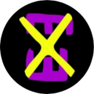

# Coletive Não-Binárie da Paraíba
 
 Website exclusivo sobre o Coletive Não-Binárie da Paraíba e suas atividades, finalidades, membres, etc


## 🌐 Aplicação Hospedada

 [Clique aqui para acessar o website](https://enne-amore.github.io/coletive-nb/)


## 🎞️ Pré-visualização

 


## ⚡ Funcionalidades

 - Menu de navegação por páginas abrível e fechável para mobile
 - Barra horizontal de navegação por dentro da página para desktop englobando uma opção de abrir uma lista de opções restantes
 - Detecção de tema de cores preferencial da pessoa usuária e adaptação da tela conforme sua preferência
 - Opções de escolher tema de cores entre escuro e claro
 - Mais acessibilidade usando a tecla "tab"
 - Efeitos de "hover" e de "active" nos elementos  clicáveis
 - Botão de voltar ao topo da página
 - Scroll horizontal arrastando através do clique do mouse nos carrosséis de imagem


## 🚀 Tecnologias Utilizadas

  <p align="left">
    
    
    
  </p>


## 📂 Estrutura do Projeto

 ```plaintext
 coletive-nb/
 ├── css/                    # Arquivos CSS
 │   ├── dark-theme.css
 │   ├── reset.css
 │   ├── responsive.css
 │   ├── style.css
 ├── docs/                   # Arquivos de documentação do projeto
 │   ├── guia-de-estilo/
 │   ├── prototipos-de-tela/
 │   ├── preview.mp4
 ├── favicon/                # Arquivos da logo como ícone  
 ├── fonts/                  # Arquivos das fontes utilizadas  
 │   ├── geometos-rounded/
 │   ├── open-dyslexic/
 ├── img/                    # Imagens utilizadas 
 ├── js/                     # Arquivos JavaScript
 │   ├── btn-mapeamento.js 
 │   ├── ilustracoes.js
 │   ├── load.js
 │   ├── menu.js
 │   ├── tema-cores.js
 │   ├── topo.js
 ├── index.html              # Arquivo principal de renderização
 ├── LICENSE                 # Arquivo de licença do projeto
 ├── README.md
 ```


## 🛠️ Instalação Local

 1. **Clone o repositório**
 
 No terminal, rode o seguinte comando:
 
 ```bash
 git clone https://github.com/Enne-Amore/coletive-nb.git
 ```
 
 2. **Entre no arquivo "index.html"**
 
 3. **Rode o arquivo principal de renderização:**
 
 Clique com o botão direito do mouse e selecione a seguinte opção:
 
 ```bash
 Open with Live Server
 ```


## 🌈 Cores

 | Cor         | Hexadecimal |
 | ----------- | ----------- |
 | Roxa Escura | `#713CA6`   |
 | Roxa Clara  | `#6A4EA6`   |
 | Amarela 1   | `#F2E530`   |
 | Amarela 2   | `#ECE35A`   |
 | Laranja     | `#F2C029`   |
 | Preta       | `#040008`   |
 | Cinza       | `#242325`   |
 | Branca      | `#FFFFFD`   |


## 🔤 Fontes Tipográficas

 - **Geometos Rounded**  
   Exemplo de uso:  
   `font-family: "Geometos Rounded";` ou 
   `font-family: var(--titulo);`
 - **Open Dyslexic Alta**  
   Exemplo de uso:  
   `font-family: "Open Dyslexic Alta";` ou 
   `font-family: var(--texto);`
 - **Open Sans**  
   Exemplo de uso:  
   `font-family: "Open Sans";` ou 
   `font-family: var(--padrao);`


## 🌟 Referências de Uso

 - [Família de ícones utilizada](https://fontawesome.com/icons)
 - [Fonte de Texto: Geometos Rounded](https://www.dafont.com/pt/geometos-rounded.font)
 - [Fonte de Texto: Open Dyslexic](https://www.dafont.com/pt/open-dyslexic.font)


## 🔧 Suporte

 Para me contatar como suporte, o meu email é [Enne.Pessoa@gmail.com](mailto:Enne.Pessoa@gmail.com)

